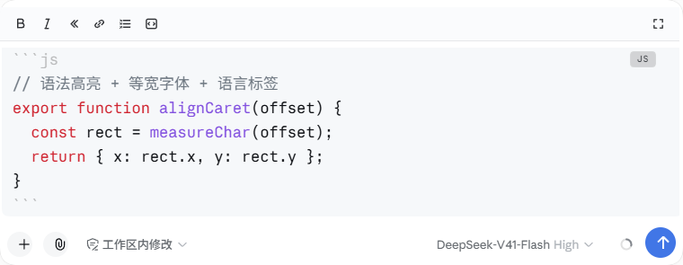
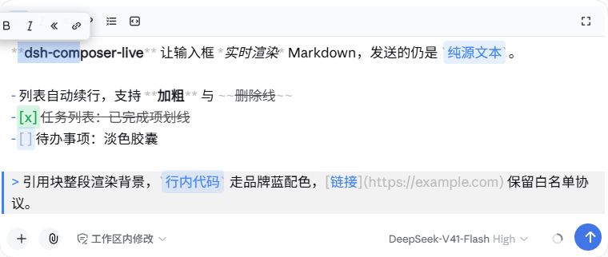

# dsh-composer-live

**Live Markdown rendering and typing enhancements for the DeepSeek Harness (DSH) web composer.**

[English](./README.md) · [简体中文](./README.zh-CN.md)


dsh-composer-live turns the DSH Web input box into an Open-WebUI-style live editor: you type Markdown, it renders as you type — bold, italic, code blocks with syntax highlighting, lists, quotes, tables — while the draft itself stays plain Markdown source, so what you send is exactly what you typed.

It is a **pure browser-side plugin**: zero runtime dependencies, no service injection, no patches to official code. It layers on top of the official 0.1.5 Lexical composer without touching what DSH already does natively.

> Looking for the DSH **0.1.x** (textarea composer) version? That's [`dsh-composer-md`](#faq), the predecessor of this plugin — discontinued.

## Screenshots

### Live markdown rendering


### Code blocks



### Selection toolbar



## Features

### Live Markdown rendering

- Inline styles render as you type: `**bold**`, `*italic*`, `` `code` `` (brand-blue capsule), `~~strikethrough~~`, `[links](url)` (whitelisted protocols), `` capsules.
- **Character-perfect caret alignment.** Marker characters (`**`, `` ` ``, `~~`, `[]()`) are dimmed but keep their exact width, and bold/headings use paint-only faux-bold — so the rendered line stays character-for-character aligned with the invisible editor text. The caret lands precisely everywhere, including inside formatted spans, with zero drift while typing.
- Task list items: `- [ ]` / `- [x]` render as checkbox capsules; completed items get struck through.
- The draft always remains plain Markdown source. Rendering is purely visual — the message you send is the source text you typed.

### Code blocks

- Typing ``` shows plain text until the fence **closes** — no half-rendered blocks while you are still typing.
- **Shift+Enter on an open fence** auto-completes a closed block (blank line + closing fence + trailing line) and puts the caret inside, ready to code.
- ↓ on the last content line of a closed block jumps below the block.
- Zero-dependency regex syntax highlighting: js/ts/py/sh/json/yml/css/html, auto-detected from content when unlabeled — Chinese prose is never misdetected as code.
- Language label on the fence line; GitHub-dark / GitHub-light block themes; fence characters dimmed.
- Monospace: while a closed code block is present, the whole composer (editor + overlay) switches to a monospace stack synced with the official code font. CJK characters deliberately stay on the UI font so line wrapping never diverges between the two layers.

### Lists, quotes, tables

- **Enter** at the end of a list line continues it: `-`/`*`/`+` markers kept, ordered markers increment (`1.` → `2.`, `3)` → `4)`), indentation kept. **Enter on an empty item exits the list** — two Shift+Enter presses end a list.
- `> ` quote lines continue the same way (`>text` without a space counts too); Enter on an empty quote item exits.
- **Tab / Shift+Tab** indent / outdent by 2 spaces — single line or whole selection block. Tab with the caret in a list marker or leading whitespace nests the item. Tab is fully intercepted: it never moves focus out of the composer.
- A table header row (`|a|b|`, ≥ 2 columns) followed by **Enter** completes the `|---|---|` separator row plus a blank line, caret on the blank line.

### Toolbars and shortcuts

- **Sticky top toolbar**: B / italic / code / link / list / code block / expand. Wraps the selection, or inserts empty markers at the caret; B lights up when the caret sits inside `**…**`. The bar is pinned to the top of the scroll area, so it never overlaps content or image attachments.
- **Selection floating format bar** (Open WebUI style): select text and B/italic/code/link appear above the selection.
- **Ctrl+B / Ctrl+I / Ctrl+E** for bold / italic / inline code — which also blocks the browser's native contenteditable bold that would silently insert real `<b>` tags into the draft.

### Paste handling

- Large pastes (> 8 lines or > 4 KB) that look like code or logs are **automatically wrapped in a code fence** — one undo step, with a toast hint. Chinese prose is not misdetected; no wrapping when the caret is already inside a code block or the paste itself contains fences.

### Esc dispatch, themes, compatibility

- **Esc** does the right thing in context: open candidate menus → official handler; expanded composer → collapse; generation in progress → stop generating.
- One-key **70vh expand** for long-form writing.
- Light/dark theme aware; IME-safe (composition input never flashes); rendering is rAF-batched and incremental.
- **@ mention chips** stay official and editable. Paragraphs containing chips gracefully degrade to official rendering (chip widths cannot be replicated; zero misalignment wins). Text decorations are unaffected.
- Also fixes two official positioning glitches when image attachments are present: the trigger menu floating far above the composer, and toolbars overlapping thumbnails.

### Not duplicated from DSH 0.1.5

The official composer already provides — and this plugin deliberately does not reimplement: `/` command menu, `@` file mentions, paste-image/file to attachments, Enter-to-send / Shift+Enter newline, IME protection, draft persistence.

## Quick reference

| Input | Context | Action |
| --- | --- | --- |
| Enter | plain line | send (official) |
| Shift+Enter | plain line | line break (official) |
| Enter / Shift+Enter | end of list / quote line | continue the marker (ordered increments) |
| Enter / Shift+Enter | empty list / quote item | remove marker, exit the list / quote |
| Enter / Shift+Enter | unclosed fence line | close the block; caret lands inside |
| Enter / Shift+Enter | table header row (≥ 2 cols) | complete separator row + blank line |
| Tab | inside a code block | insert 2 spaces at caret |
| Tab | list/quote marker or leading whitespace | indent line (nested list) |
| Tab | anywhere else | insert 2 spaces at caret |
| Tab / Shift+Tab | multi-line selection | indent / outdent the whole block |
| Shift+Tab | any line | outdent up to 2 spaces (absorbs the key when none) |
| Ctrl+B / Ctrl+I / Ctrl+E | anywhere | wrap selection bold / italic / code, or insert empty markers |
| ↓ | last content line of a closed block | jump below the block |
| Esc | menus open → official · expanded → collapse · generating → stop | context dispatch |

## Requirements

- **DSH ≥ 0.1.5-rc.2**, `web` profile — the plugin targets the 0.1.5 Lexical contenteditable composer.
- A **Chromium-based browser** (Chrome, Edge, …): the transparency technique relies on `-webkit-text-fill-color`.
- OS-independent — it is pure DOM/CSS with no native dependencies.

## Installation

```bash
# from npm (recommended)
dsh plugin --profile web add dsh-composer-live

# or from a local checkout (file: installs are physically copied)
dsh plugin --profile web add "file:/path/to/dsh-composer-live"
```

**Restart the web instance after installing.** Plugins load from a startup snapshot; refreshing the page alone can leave old and new bundles coexisting.

Running an isolated DSH instance? Point `DSH_HOME` at it so the plugin installs there instead of the default `~/.dsh`:

```bash
DSH_HOME=/path/to/your/.dsh dsh plugin --profile web add dsh-composer-live
```

## Usage

Everything is on by default — install, restart, and type Markdown in the composer.

Typical flows:

- **Code block**: type ```` ```js ````, press Shift+Enter — a closed block appears with the caret inside. Code with live highlighting; Tab indents two spaces; press ↓ on the last content line to exit below the block.
- **List**: type `- item`, press Shift+Enter to continue items; press Shift+Enter on an empty item to end the list. Tab nests, Shift+Tab un-nests.
- **Long text**: hit the expand button (or work as usual) — the composer grows to 70vh for long-form writing; Esc collapses it.
- **Paste a log**: a big chunk of code or log text becomes a fenced code block automatically; Ctrl+Z if you don't want that.

## How it works

The official composer is a Lexical contenteditable editor. This plugin makes its text invisible with `-webkit-text-fill-color: transparent` (the `color` property is kept, so the caret and official decorations keep working) and paints its own rendering layer — with every rendered character positioned at the editor's real text coordinates, measured per-character from Range rects.

Because the overlay never does its own layout, alignment bugs (drift, jitter, misplacement) cannot exist by construction: measured deviation is ≤ 0.02px across scenarios, 0.00 per keystroke frame.

The plugin injects no official services. It reads the editor DOM directly and derives a "projection text" (chips → U+FFFC, `<br>`/paragraph boundaries → newlines), which keeps it immune to client API churn; DOM anchoring uses stable `data-` attributes instead of hashed CSS-module class names. Draft edits (list continuation, fence completion, indenting…) go through Lexical-native channels — synthetic `beforeinput` events that preserve the undo stack — never direct DOM mutation.

See [docs/architecture.md](./docs/architecture.md) for the full deep dive.

## Known limitations

- Paragraphs containing **@ chips** render as plain official text (chip widths cannot be replicated; zero misalignment wins). Text-ref decorations are unaffected.
- Block visuals (headings, quotes, lists, table markers) are paint-only — color, weight, background. Never font size, line height, or indentation; the source layout is preserved so line metrics never change.
- Whole-composer monospace applies whenever a closed code block is present (not per-line — a literal-`\n` single-text-node draft makes per-line font switching physically impossible).
- Fence-completion caret placement waits 80 ms for Lexical's async commit; on very slow machines the caret may occasionally land slightly late.
- ↓ jump-out only triggers on the last content line of a **closed** block; an unclosed fence falls through to the official handler.
- "Stop generating" is matched by aria-label (English and Chinese enumerated); if upstream renames the label, use the button directly.
- `web` profile only; Chromium-family browsers only.

## Development

```bash
node test-live.cjs                  # 188 unit tests (pure functions, no browser needed)
node e2e/run-e2e.mjs --with-deploy  # 53-scenario × 10-invariant E2E suite against a live instance
```

The E2E suite replays six real input channels (literal `\n` / literal `\r\n` / line-by-line br / insertParagraph / synthetic paste / refresh-restore multi-paragraph) and cross-checks an independent projection against the plugin's own, character by character. See [e2e/README.md](./e2e/README.md).

Version discipline: every change bumps `package.json` and gets a [CHANGELOG.md](./CHANGELOG.md) entry.

## FAQ

**Why Chromium-only?**
The transparency trick (`-webkit-text-fill-color`) and several caret behaviors are Chromium-specific. Firefox/Safari would need a different approach.

**Does it change what I send?**
No. The draft is always plain Markdown source; rendering is purely visual.

**Is per-character measurement slow?**
It is batched per render frame and merged into a few absolutely-positioned spans. The overlay is `pointer-events: none` and out of flow, so it causes no reflow of the editor. Measured per-keystroke delta is 0; no perceptible input latency.

**Will a DSH update break it?**
Zero service injection plus `data-`-attribute anchoring make it resilient to routine updates (class-name hash churn, client API refactors). When the official composer *architecture itself* changes — as 0.1.1 → 0.1.5 did, textarea → Lexical — the plugin needs a port. This plugin *is* that port: `dsh-composer-md` was its 0.1.x predecessor and is now discontinued.

## License

[MIT](./LICENSE)
